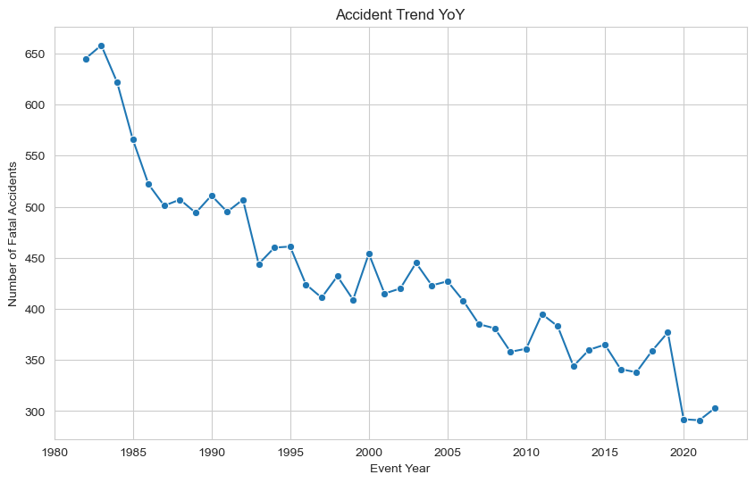

<h1 align="center">AVIATION ACCIDENTS RISK ANALYSIS</h1>

Image By: [Jeremy](https://unsplash.com/photos/gray-scale-photo-of-airplane-beside-sea-CjsVt-CgTkU)

## Table of Contents
 1. *Project Introduction*
 2. *Data Understanding*
 3. *Exploratory Data Analysis (EDA)*
 4. *Conclusion and Recommendations*
 5. *Links and Resources* - *(Tableu Interactive Dashboard & Data Source)*

## Project Structure and Navigation

- *`README.md` — Project documentation*
- *`Aviation_risk_analysis_notebook.ipynb`  — Jupyter notebook for analysis*
- *`Images/` — Saved plots and figures*
- *`Data/` — Dataset files*
- *`Presentation/` — Project summary slides PDF*

# **1. Introduction and Business Understanding**
Our company is exploring entry into the aviation business by acquiring private and commercial operations aircrafts. 

To guide and inform this decison; we need a data driven risk analysis to gauge the risk associated with this venture. To get to this; we will analyze and understand the risks involved by focussing on

- Aircraft types and manufacturers
- Flight phases
- Weather conditions
- Injuries analysis

**Problem**: The aviation division lacks data-driven insights on aviation risks for informed investment.

**Stakeholder**: Head of Aviation Operations.

**Goal**: Insights will help the stakeholder make safer investment decisions by avoiding high-risk aircraft and conditions.

## **Overview**
This project will be using NTSB aviation accident database to answer below key question that will guide Stakeholders and real world questions related to investments in this industry:

- Which aircraft manufacturers and models are linked to the most fatal accidents?
- Are there specific phases of flight or weather conditions that present higher risks?
- How have accident trends evolved over time?
- How are injury types correlated?

# **2. Data Understanding**

**Data Source**:

- The Data source is from **[NTSB Aviation Accident Database (1962-present)](https://www.kaggle.com/datasets/khsamaha/aviation-accident-database-synopses)** — Civil aviation accidents in the U.S., its territories, and international waters. 

**Why this data?**:
- This database contains comprehensive coverage of aviation accidenst, Aircraft information, flight conditions, injury states and many more that will help in answering our questions above. 

**Data Overview**:
- The data has 88,889 entries and 31 columns. The main features to help us in this Analysis are Aircraft Make, Model,Fatality,Phase of Flight, Weather Conditions, Accident Date and Location. 

**Limitations**:
- Many missing values (e.g., Latitude, Longitude)
- Data mostly concentrates on USA and may not fully represent the glaobal risks. 

# **3. Data Analysis**

### **3.1 Fatal accidents by manufacturer and model Analysis**

**Top 10 Aircraft Models by Fatal Injuries visual observation**

- Boeing aircrafts are dominant in the list probably due to their widespread use but also warrants a closer examination of its safety records. 
- Cessna comes in forth, raising alarm noting is a smaller aircraft often used in training and non-commercial activities. this raises questions around pilot experiences, flight conditions and maintenance as mostly are often flown by private pilots. 
- Airbus A321 and Piper PA-28-181 appear in the list but with fewer fatal injuries but still significant to be in the top list. 
- Commercial aircrafts are more in the fatal list due to their high flight numbers but smaller aircrafts like (Cessna, Piper) are also noted to have high fatal injuries.

**Business Insight and recommendation**

- Conduct detailed safety reviews before purchasing a boeing or Cessna models. 

### **3.2 Are there specific phases of flight or weather conditions that present higher risks?**

**Phase and weather Visualization**

*Flight Phase*

- Landing is critical as it has the highest number of fatal accidents(15,384 cases), followed by Takeoff(12,435) and Cruise (10,208). Business should invest on trainings in this areas and more strict rules. 
- Maneuvering and cruise also shows significant count

*Weather Condition*

- its noted that 88% of fatal accidents occur in clear weather and not in bad weather highlighting that other factors contribute to accidents. 

**Business Insight and recommendation**

- landing, takeoff, and cruise phases should be targeted for more trainings
-weather conditions do not influence accidents, hence human factor trainings should be emphasised at all times.

### **3.3 Accidents trend over time**

**Fatal_trend Observation**
- Aviation accidenst have generally declined over the years. 
- noted small spikes in some years but overall ther accidents have declined over the rears.

**Business Insight and recommendation**
- Focus investments on newer aircrafts for safety as they tend to come with new advanced safety technologies.

### **3.4 Correlation Analysis on injuries**

**Fatal_trend Visualization Observation**
- Correlations are minimal (none above 0.22), suggesting injury types behaves fairly independently.

**Business Insight and recomendation**
- Distinct safety strategies to be adopted. One-size-fits-all  won't maximize results on injuries cause. 

# **4. Conclusion and Overall Recommendations**

**Based on observation and recommedations given in each visual and analysis to enable guidance on safer investment and operation decisions; below conclusion and recomendations are proposed** 

### Conclusion

1. ***Aircraft Models and Fatalities*** 

- Boeing aircrafts are dominant in the list likely due to their widespread use but also warrants a closer examination of its safety records. 
- Though Cessna are mostly flown by private pilots for non-commercial activies and small in size, they are fatal and deeper analysis e.g pilots experience and maintanance should be checked. 

2. ***Flight Phase and Accident Risk*** 

- Landing(15,384 cases), Takeoff(12,435) and Cruise (10,208)are the riskiest and more training investment should go towards that. 
- shockingly 88% of fatal accidents occur in clear weather highlighting that other factors contribute to accidents like human errors, technical faults, or operational risks play a larger role than adverse weather alone

3. ***Fatal_trend over time*** 

- Aviation accidents have generally declined over the years with small spikes in some years that cant affect the downward overall decline. 
- clearly shows technology has improved and purchasing new models is safer

4. **Injuries preventions**

- The correlations are low and hence each behave independently and should be handled independently on precation measures taken

### Recomendations

1. ***Aircraft Selection*** 

- Conduct detailed safety reviews before purchasing a boeing or Cessna models. 
- invest in new models which will have improved technological advancements

2. ***Pilot Training and operations***

- Based on flight phase accidents; invest on proper trainings on Landing, Takeoff and Cruise. 
- Also noted is weather conditions do not influence accidents, hence human factor trainings should be emphasised at all times.

3. ***Maintenance and Inspections***

- Small and private aircrafts like Cessna and Piper should go under thorough maintenance and inspections noting the high risks

4. ***Tailored Safety Strategies***

- Develop distinct injury mitigation stategies noting they are independent and one-size-fit-all approach will not prevent the diverse causes of injuries. 

# **5. Links and resources**

- **Dataset Source** : [NTSB Aviation Accident Database (1962-present)](https://www.kaggle.com/datasets/khsamaha/aviation-accident-database-synopses)
- **Tableau Link** : [Aviation Risk Analysis Tableau Dashboard](https://public.tableau.com/views/Aviation_risk_analysis_17457074989370/Dashboard1?:language=en-US&publish=yes&:sid=&:redirect=auth&:display_count=n&:origin=viz_share_link)

